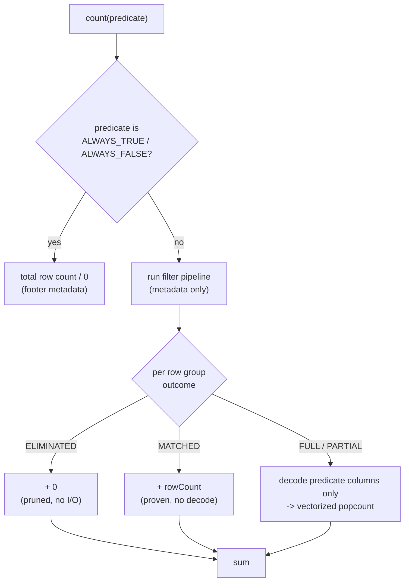

# Counting in parquetry

How `count(predicate)` returns the number of matching rows without materializing
any of them, and why it is often thousands of times cheaper than reading. This is
the counting face of the read path. Read [The parquetry read path](read-path.md)
first for the filter pipeline and the row-group outcomes this builds on.

The guiding rule: **count proves what it can from statistics and counts the rest
with a columnar popcount - it never materializes a record.** A `read().count()`
decodes every surviving row into a `ParquetRecord` only to drop it. `count()` does
none of that.

---

## 1. What count is

`ParquetReader.count(predicate, options)` returns how many rows satisfy
`predicate`. It is the answer to a GeoTools `getCount(Query)`, a `SELECT count(*)
WHERE ...`, or any "how many" that does not need the rows themselves.

```java
try (ByteRangeSource source = ByteRangeSource.ofFile(path)) {
    ParquetReader reader = ParquetReader.open(source);
    long matches = reader.count(Pred.col("year").gtEq(2020), ReadOptions.DEFAULTS);
}
```

The result is always identical to `read(predicate).count()` - same rows, same
number. The difference is entirely in the work done to produce it. The win comes
from a single idea: the read path already classifies every row group by a
filter-pipeline outcome, and count can answer two of those outcomes from metadata
alone.

---

## 2. The three routings

`count()` runs the same metadata-only filter pipeline as `read()`, then routes
each row group by its [outcome](read-path.md#4-filtering-the-five-tiers). Two of
the four outcomes are answered with no column decode at all.



| Outcome | Contributes | Cost |
|---------|-------------|------|
| `ELIMINATED` | `0` | none - the pipeline already proved no row matches |
| `MATCHED` | `rowCount()` | metadata only - statistics proved every row matches |
| `FULL` / `PARTIAL` | popcount of the matches | decode the predicate columns only, then count columnar |

A whole-file `ALWAYS_TRUE` short-circuits to the summed row counts before the
pipeline runs, and `ALWAYS_FALSE` returns `0`. Only the residual `FULL` / `PARTIAL`
row groups touch column data, and even then only the predicate's columns - never
an output projection, never a `ParquetRecord`.

---

## 3. Proving a whole row group matches

`ELIMINATED` (no row matches) has always existed - it is how the pipeline prunes.
Counting adds its mirror image, `MATCHED` (every row matches). A proven row group
then contributes its row count with zero decode.

The proof lives in the STATS tier. `StatsEvaluator` already returns three verdicts
per row group - `Eliminated`, `PassedAll`, `NotApplied` - and the pipeline now
promotes a STATS `PassedAll` to the `MATCHED` outcome, short-circuiting the later
tiers (the same way `Eliminated` short-circuits). For example `year > 5` is
`PassedAll` when the row group's `min(year)` is already above 5.

Because `MATCHED` makes the read path **skip evaluation** (count adds the row
count, and `read()` returns the rows without re-testing them), the proof has to be
sound, not just useful. A false `MATCHED` would overcount. The guard
`canProveAllMatch` admits a comparison proof only when:

- **`nullCount == 0`.** A null never satisfies a comparison. A column with any
  null cannot be all-match (`year > 5` is false for a null `year`).
- **the column kind is exactly bounded:** `BOOLEAN`, `INT32`, `INT64`. `FLOAT` and
  `DOUBLE` are excluded (a `NaN` breaks min/max ordering), and binary
  (`BYTE_ARRAY` / `FIXED_LEN_BYTE_ARRAY`) is excluded because its statistics may be
  truncated, leaving the stored max below the true max.

Two more conservative edges: a missing null count reads back as `-1` and fails the
`== 0` test, and an empty row group (`rowCount == 0`) is never promoted to
`MATCHED`. When in doubt the verdict stays `NotApplied`, and the row group falls
through to the residual count - slower, never wrong.

`MATCHED` is a shared outcome, not a count-only one: on the read path a `MATCHED`
row group also streams all its rows without running the per-row record filter (see
[read-path.md](read-path.md)).

---

## 4. Counting the residual: a columnar popcount

A `FULL` or `PARTIAL` row group is one the statistics could not settle. Its rows
must be tested. Count does this without building a single record. It decodes the
predicate's columns into the usual columnar `ParquetRecordBatch`, then
`VectorizedPredicateEvaluator` turns the predicate into a `BitSet` of matching
rows. The count is that bitset's `cardinality()`.

- **`IsNotNull` is a pure popcount** over the column's validity mask;
  `IsNull` is its complement. No values are compared at all.
- **A comparison scans the typed primitive array** (`int[]`, `long[]`, `double[]`,
  ...), sets a bit where the comparison holds, and intersects with validity - a
  null row is structurally excluded, matching the record-level rule.
- **`And` / `Or` / `Not`** are `BitSet` intersection / union / complement of the
  child masks.

The evaluator is held to the same semantics as the row-by-row
`RecordLevelEvaluator`: both route every comparison through the shared
`ValueComparison` core (one definition of type coercion and Parquet's unsigned
binary ordering). A residual count and a `read().count()` therefore agree on every
boundary value. The difference is only the shape of the work - a tight columnar
scan and a popcount instead of per-row record assembly.

---

## 5. What it costs

`CountBenchmark` (JMH) times `count()` against the `read(predicate).count()`
baseline over a 1M-row file (sorted, non-null `id`, 100k rows per group):

| Path | `count()` | `read().count()` | Speedup |
|------|----------:|------------------:|--------:|
| `ALWAYS_TRUE` (metadata sum) | 0.004 us | 19,677 us | ~4,900,000x |
| `MATCHED` (`id >= 0`, no nulls) | 1.37 us | 38,069 us | ~27,900x |
| `IS_NOT_NULL` (no nulls -> proven) | 1.33 us | 37,905 us | ~28,600x |
| `RESIDUAL` (`id > 500k`) | 1,909 us | 20,417 us | ~10.7x |
| `ELIMINATED` (`id > 1M`) | 1.30 us | 1.45 us | ~1.1x (parity) |

Three regimes show up:

- **Proven paths go from O(rows) to O(row groups).** When statistics decide the
  whole file - `ALWAYS_TRUE`, `MATCHED`, a no-null `IsNotNull` - count is
  constant-time in the microseconds and never decodes a column, while the baseline
  scans all 1M rows. This is the headline case, and the common one for a layer's
  feature count.
- **The residual path still wins about 10x** by decoding only the predicate column
  and counting columnar instead of materializing records.
- **`ELIMINATED` is parity** - `read()` already drops fully-pruned row groups by
  statistics, leaving no decode to save. Count produces no spurious win where none
  is available.

---

## 6. Edges and limits

- **Spatial predicates** are lowered before counting exactly as they are before
  reading (covering-column comparisons where the file supports them, or the WKB
  envelope test where it does not). A bbox count reuses the spatial pruning described in
  [spatial-filtering.md](spatial-filtering.md). The vectorized evaluator's spatial
  arms exist but are not yet exercised by a count-path test - a known gap to close
  before counts are relied on for spatial workloads.
- **Null correctness** is identical to the read path: comparisons exclude nulls,
  `IsNull` / `IsNotNull` are decided purely by the validity mask.
- **Timestamp comparisons over decoded batches** currently match every row in both
  `count()` and `read()` (the batch path returns a raw `long` for an `INT64`
  timestamp column, which neither evaluator coerces against a timestamp bound).
  This is a pre-existing batch-path limit, not a counting regression: the two stay
  consistent. A real `INT64`-timestamp comparison arm is the fix.

---

## 7. Where to look

| Concern | Start in |
|---------|----------|
| Count entry + routing | `data/ParquetReader.java` (`count`) |
| Columnar popcount sink | `data/read/BatchPipeline.java` (`countMatching`) |
| Predicate -> matching `BitSet` | `batch/VectorizedPredicateEvaluator.java` |
| Shared comparison core | `filter/ValueComparison.java` |
| All-match proof | `filter/StatsEvaluator.java` (`canProveAllMatch`, `PassedAll`) |
| MATCHED outcome + short-circuit | `filter/RowGroupOutcome.java`, `filter/FilterPipeline.java` |
| Benchmarks | `internal/parquetry-benchmarks/.../CountBenchmark.java` |

---

*Scope: counting rows over a single Parquet / GeoParquet file. The dataset-level
count over many files (the catalog facade GeoServer consumes) delegates to this
per-file count. The general read path is in [read-path.md](read-path.md). Spatial
filtering is in [spatial-filtering.md](spatial-filtering.md).*
