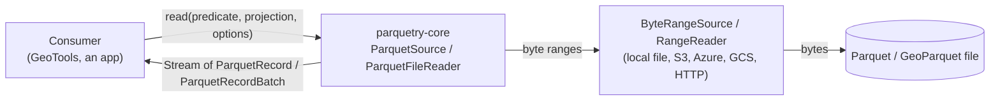
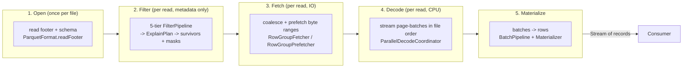
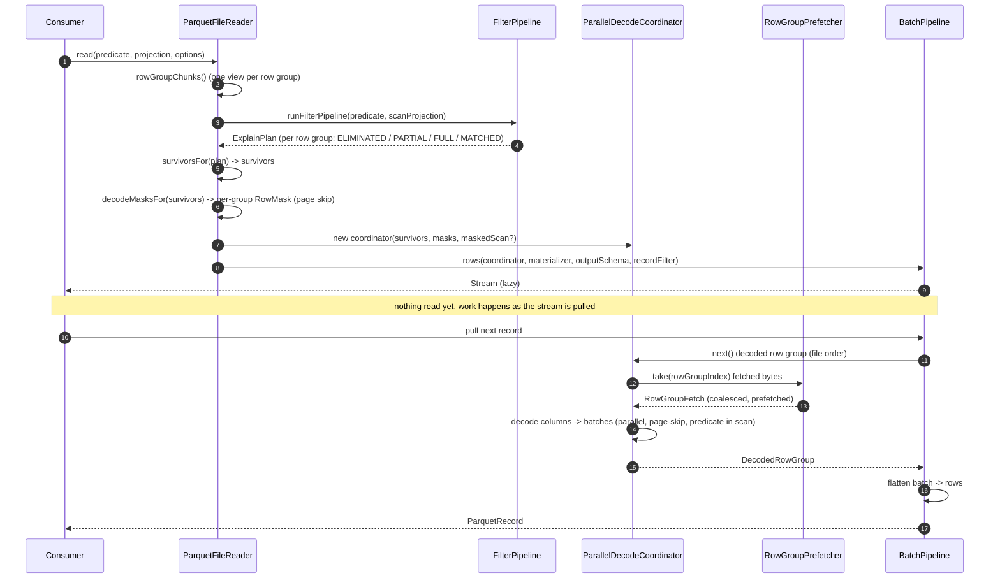
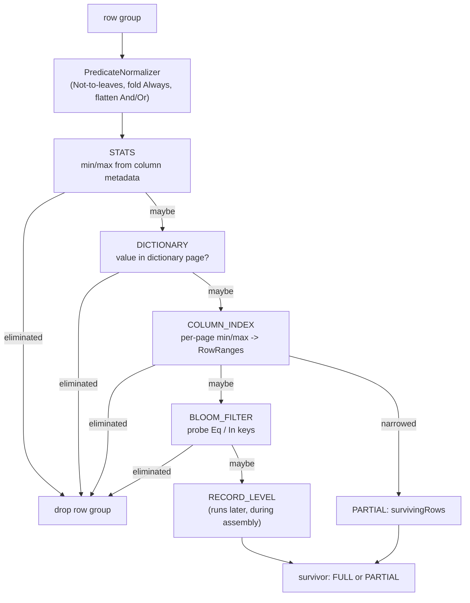
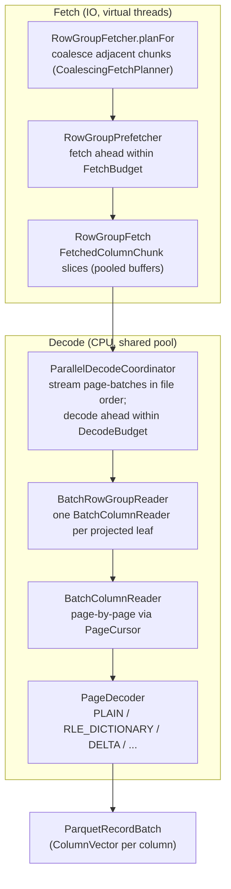
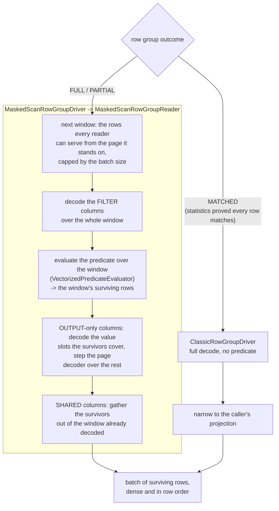
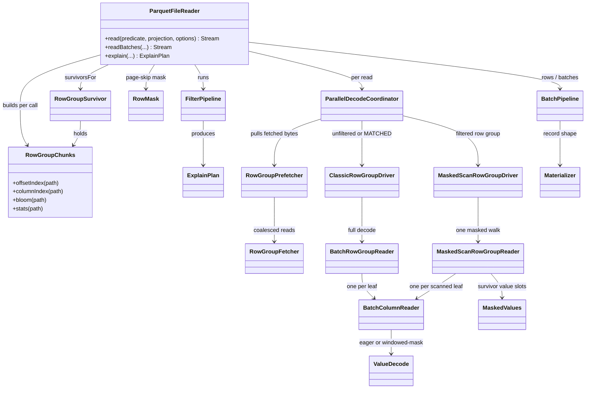

# The parquetry read path

How a `read()` turns a Parquet file on some byte source into a stream of records,
explained from the top down. Each section zooms in one level; stop wherever you
have enough detail. Diagrams are [Mermaid](https://mermaid.js.org/) and render on
GitHub.

The guiding principle never changes: **filter, then fetch, then decode, then
materialize.** Everything below is detail hanging on those four verbs.

---

## 1. System context

What talks to what. `parquetry-core` reads one file; it does not own the bytes or
the threads the consumer runs on.

- The consumer passes a **predicate** (what rows), a **projection** (what
  columns), and **ReadOptions** (tunables), and gets back a lazy `Stream`.
- parquetry reads through a byte-range abstraction; it never assumes a local
  file. The consumer opens and closes that source.
- The reader is immutable and thread-safe; each `read()` allocates its own
  per-call state.

---

## 2. The four-stage pipeline

The one diagram to hold in your head. A `read()` flows left to right; the lead
type of each stage is named under it.

| Stage | Does | Reads | Lead types |
|------|------|-------|-----------|
| Open | decode the footer once, build the schema | footer bytes | `ParquetFileReader`, `FileMetaData`, `ParquetSchema` |
| Filter | drop row groups and pages that cannot match, using metadata only | footer + index sections | `FilterPipeline`, `ExplainPlan`, `RowGroupSurvivor`, `RowMask` |
| Fetch | turn the surviving column chunks into a few coalesced range reads, prefetched | column-chunk bytes | `RowGroupFetcher`, `RowGroupPrefetcher`, `FetchedColumnChunk` |
| Decode | decompress + decode pages into columnar batches, streamed in file order, decoding upcoming row groups ahead within a heap budget | (in memory) | `ParallelDecodeCoordinator`, `DecodeBudget`, `BatchRowGroupReader`, `BatchColumnReader` |
| Materialize | flatten batches into the caller's record shape | (in memory) | `BatchPipeline`, `Materializer`, `ParquetRecord` |

Two cross-cutting helpers thread through filter, fetch, and decode:

- **`RowGroupChunks`** - a per-call view of one row group's column chunks that
  memoizes its index sections (offset index, column index, bloom filter); each is
  read at most once no matter how many stages ask.
- **`ReadOptions`** - the tunables: which filter tiers run, the buffer pool, the
  off-heap fetch budget, the on-heap decode budget, prefetch depth, decode
  parallelism.

---

## 3. One `read()`, end to end

The control flow for a single `read(predicate, projection, options)`. This is the
spine; later sections expand the boxes.

Key points the diagram encodes:

- **The stream is lazy.** `read()` returns immediately; filtering at the metadata
  level has run, but no column bytes are fetched or decoded until the consumer
  pulls.
- **Filter expands the projection.** When the record-level filter is on, the
  *scan* projection is the caller's projection plus the predicate's columns, so
  the predicate can be evaluated even on columns the caller did not ask for. The
  *output* schema stays the caller's projection.
- **Outcomes flow forward.** Per row group, the plan yields `ELIMINATED`
  (dropped), `FULL` (read every row), `PARTIAL` (read only `survivingRows`), or
  `MATCHED` (statistics proved every row matches - read every row, but skip the
  per-row record filter). `PARTIAL` becomes a `RowMask` that skips non-surviving
  pages during decode.

`readBatches()` is the same spine without the last step: it returns the batches
themselves, holding exactly the rows the predicate matched, narrowed to the
caller's projection. The row `read()` is `readBatches`' pipeline plus
row-flattening into the caller's record shape.

---

## 4. Filtering: the five tiers

The filter pipeline runs on **metadata only** - no column data is decoded here.
Each row group is run through five tiers in increasing cost; the pipeline
short-circuits the moment a tier proves the row group cannot match - or that every
row matches.

- **Cheapest first.** STATS and DICTIONARY read only the footer. COLUMN_INDEX and
  BLOOM read small index sections (loaded lazily and memoized by
  `RowGroupChunks`). RECORD_LEVEL is the only tier that needs decoded values, so
  it runs later, inline during assembly, not here.
- **COLUMN_INDEX is the lever for selective reads.** It narrows a row group to the
  pages whose min/max bounds overlap the predicate, producing `survivingRows` (a
  `RowRanges`). That is what lets decode skip whole pages.
- **STATS also proves the positive.** When a row group's statistics prove *every*
  row matches - not just that some might - the STATS tier short-circuits to the
  `MATCHED` outcome. A `MATCHED` row group is read in full but skips the per-row
  record filter, and [`count()`](counting.md) answers it from the row count with no
  decode at all. [Counting](counting.md#3-proving-a-whole-row-group-matches)
  explains the deliberately conservative proof that keeps this sound.
- **The output is an `ExplainPlan`** - the same structure `explain()` returns and
  `toAsciiTable()` / `toJson()` render. `survivorsFor` turns it into the
  `RowGroupSurvivor` list the rest of the pipeline consumes.

`RowGroupChunks` is what keeps this honest: the tiers ask it for a column's
stats / column index / bloom filter, and it loads each section once and hands the
same instance to the decode-mask builder later.

Bbox spatial predicates over a GeoParquet geometry column add one row-group tier,
`SPATIAL`, after STATS, plus a covering-column lowering step that feeds the STATS
and COLUMN_INDEX tiers above. See [Spatial filtering](spatial-filtering.md).

---

## 5. Fetch and decode

Surviving row groups still hold raw bytes. Fetch turns them into a handful of
coalesced range reads; decode turns those into columnar batches, in parallel,
while preserving file order.

What each piece guarantees:

- **`RowGroupFetcher`** issues one read per coalesced range, not one per column,
  and hands out zero-copy `FetchedColumnChunk` views into pooled buffers.
- **`RowGroupPrefetcher`** fetches upcoming row groups ahead of consumption on a
  per-read virtual-thread pool, bounded by a process-wide `FetchBudget` that caps
  the off-heap bytes a read may speculatively prefetch.
- **`ParallelDecodeCoordinator`** decodes several row groups concurrently on a
  shared CPU pool but returns them in file order; the stream stays ordered. A
  decode worker streams one page-batch at a time into a small bounded hand-off
  (currently two batches) and parks under backpressure when the consumer is slow.
  A single row group is never fully resident; only the in-flight window of its
  batches is.
- **`BatchColumnReader`** is page-at-a-time. Each page is decompressed into a
  short-lived confined `Arena`, decoded into heap arrays, and the arena is closed
  before the next page. With a `RowMask`, `PageCursor` skips non-surviving pages
  outright, and surviving pages are compacted to the surviving rows.

**Memory contract.** Two budgets bound a read. `FetchBudget` caps the *off-heap*
bytes a read may speculatively prefetch for column-chunk fetches; off-heap memory
counts against a container's limit and is invisible to `-Xmx`. `DecodeBudget`
(`ReadOptions.decodeBudget`) caps the *on-heap* bytes a read may hold in
speculatively decoded batches, inside `-Xmx`. Only speculative decode-ahead is
controlled by `DecodeBudget`: the in-order current row group (the one the consumer
is reading) never reserves budget, which is what prevents deadlock. When the
consumer advances to a row group that was decoding ahead, the coordinator promotes
it, and it stops reserving. `maxDecodeAheadPerRead` is a concurrency cap on decode
worker slots, not a memory bound; a speculative row group decodes ahead only when a
slot is free and budget headroom exists, and under slot contention a read degrades
to inline (synchronous, still memory-bounded) decode on the consumer thread.

Peak process memory is approximately `maxHeap (-Xmx, includes the on-heap
DecodeBudget) + FetchBudget (off-heap) + retained segment pool (off-heap) + JVM
native baseline`. The design target is a GeoServer pod with 1-2 GB for parquetry,
not "load the file." Sizing both budgets against a container limit is covered in
[Memory and tuning](memory-and-tuning.md).

---

## 6. The masked scan

Decoding every surviving row's output columns and then dropping the non-matches
is wasteful under a selective predicate. A filtered read therefore decodes each
row group in **one pass that applies the predicate as it goes**: the filter
columns decode, the predicate runs over them, and an output column materializes
a value only where the predicate kept the row. One driver per row group, one
walk over the bytes.

- **A window is page-bounded, not row-group-bounded.** It is the run of rows every
  scanned column can serve from the page it currently stands on, capped by the
  read's batch size. A window whose rows all fail the predicate emits nothing and
  materializes no output value at all.
- **Output columns pay for survivors only.** An output-only leaf reads the value
  slots its surviving rows cover and steps its page decoder past the rest
  (`ValueDecode.WINDOWED_MASK`, survivor slots computed by `MaskedValues`).
  Decoded-value count tracks selectivity, not page size.
- **A column that both filters and outputs is read once.** It decodes as a filter
  column, and its surviving rows are gathered out of the window already in hand
  rather than through a second reader over the same pages.
- **`MATCHED` row groups never reach the scan.** Statistics already proved every
  row matches; there is nothing to evaluate. They take `ClassicRowGroupDriver`
  over the scan schema, and the batch pipeline narrows the result to the caller's
  projection - which is what keeps a predicate-only column out of the emitted
  shape.
- **Unfiltered reads are untouched.** No predicate means no scan:
  `ClassicRowGroupDriver` decodes the projection and nothing narrows.
- **Offset indexes are not required.** The scan walks pages as it meets them.
  Where the `COLUMN_INDEX` tier did produce a `RowMask`, the scan's readers take
  it and walk only the surviving rows; the two compose. Building that mask still
  needs offset indexes and flat scan columns (section 4), and it is the mask, not
  the scan, that is flat-only.
- **Nested output columns are supported.** Repetition and definition levels travel
  with each window and are gathered alongside the values. A row whose values
  outrun the page it started in is followed across the boundary as a one-row
  window.
- **Both `read()` and `readBatches()` take it.** The predicate is applied exactly
  during decode, and no per-row filter runs afterwards at materialization.
- **The walk is proved.** A scan whose windows do not add up to the rows the plan
  left it throws `MalformedFileException` rather than silently dropping rows.

[`count()`](counting.md) pushes the same instinct to its limit: it materializes
no records at all, answering proven row groups from metadata and counting the rest
with a columnar popcount over the decoded predicate columns.

---

## 7. Key types

A map to place any class you land on. Arrows are "uses / produces".

---

## 8. Where to look

| Stage | Start in |
|------|----------|
| Entry, orchestration | `data/ParquetFileReader.java`, `data/ReadOptions.java` |
| Footer + schema | `format/ParquetFormat.java`, `schema/SchemaBuilder.java` |
| Filter pipeline + tiers | `internal/filter/FilterPipeline.java`, `internal/filter/*Evaluator.java`, `filter/explain/ExplainPlan.java` |
| Per-call chunk view | `internal/read/RowGroupChunks.java` |
| Survivors + page-skip mask | `internal/read/RowGroupSurvivor.java`, `internal/read/RowMask.java`, `internal/read/page/PageSelection.java` |
| Fetch | `internal/read/RowGroupFetcher.java`, `internal/read/RowGroupPrefetcher.java`, `internal/read/CoalescingFetchPlanner.java` |
| Parallel decode + budgets | `internal/read/ParallelDecodeCoordinator.java`, `internal/read/StreamingBatchSource.java`, `runtime/DecodeBudget.java`, `internal/read/BatchRowGroupReader.java` |
| Column / page decode | `internal/read/BatchColumnReader.java`, `internal/read/page/PageCursor.java`, `internal/read/page/PageDecoder.java` |
| Masked scan (filtered decode) | `internal/read/MaskedScanRowGroupReader.java`, `internal/read/MaskedScanRowGroupDriver.java`, `internal/read/MaskedValues.java`, `internal/read/ValueDecode.java` |
| Materialize | `internal/read/BatchPipeline.java`, `materializer/Materializer.java` |
| Counting (no materialization) | `data/ParquetFileReader.java` (`count`), `internal/read/BatchPipeline.java` (`countMatching`), `columnar/VectorizedPredicateEvaluator.java` |

---

*Scope: the row and batch read paths. Flat and nested/repeated columns both go
through the masked scan; the column-index page-skip mask is the flat-only part,
and a read whose scan columns are not all flat simply runs the scan without one.
Spatial (bbox) filtering is covered in [spatial-filtering.md](spatial-filtering.md),
counting without materialization in [counting.md](counting.md). Writing, encryption,
and the geometry materializer are documented separately.*
