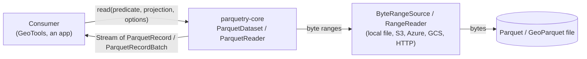
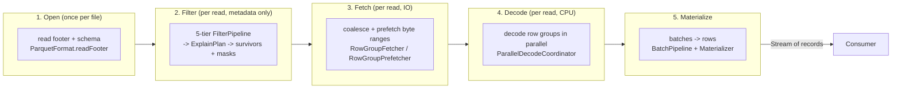
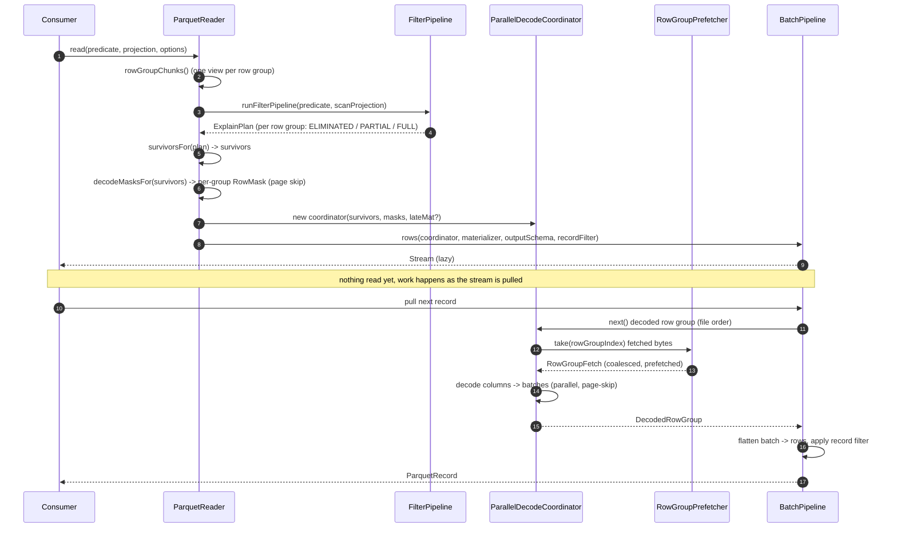
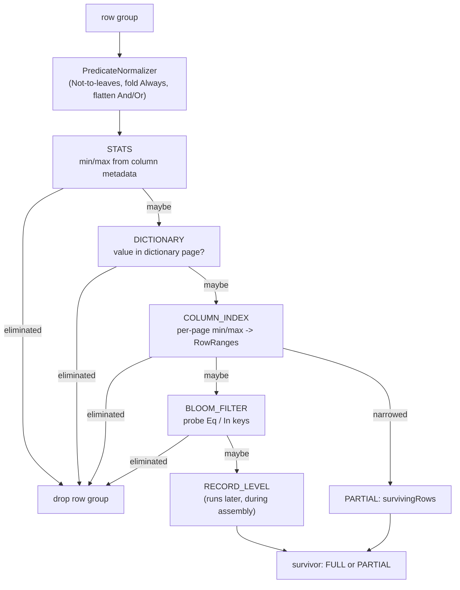
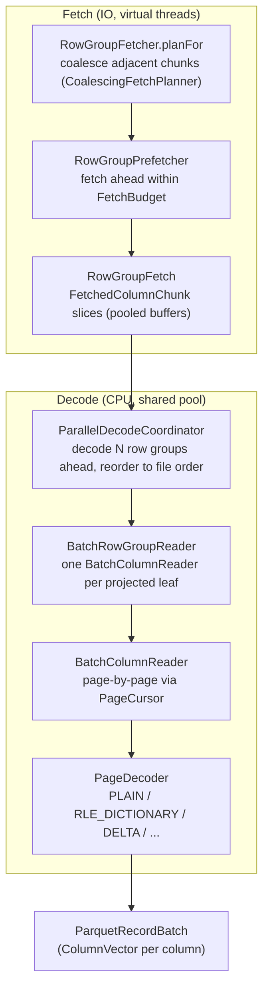
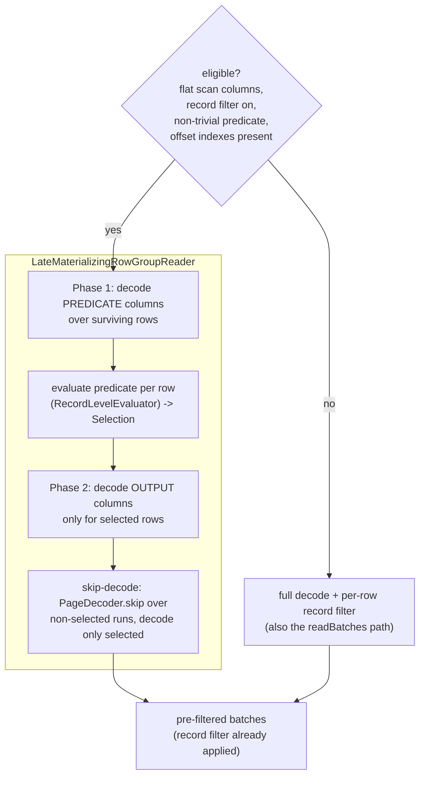
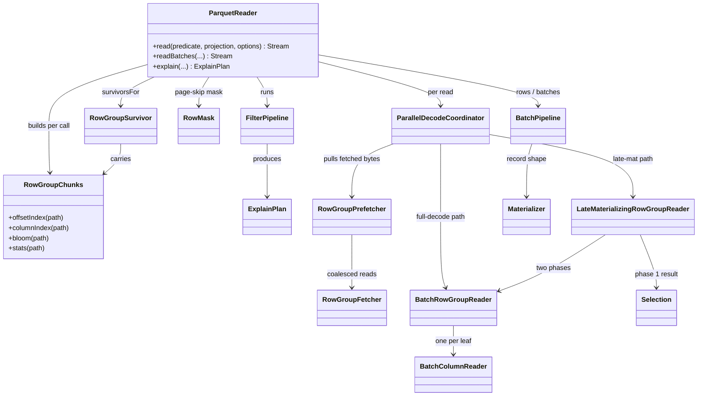

# The parquetry read path

How a `read()` turns a Parquet file on some byte source into a stream of records,
explained from the top down. Each section zooms in one level; stop wherever you
have enough detail. Diagrams are [Mermaid](https://mermaid.js.org/) and render on
GitHub.

The guiding principle never changes: **filter, then fetch, then decode, then
materialize.** Everything below is detail hanging on those four verbs.

---

## 1. System context

What talks to what. `parquetry-core` reads one file; it does not own the bytes or
the threads the consumer runs on.

- The consumer passes a **predicate** (what rows), a **projection** (what
  columns), and **ReadOptions** (tunables), and gets back a lazy `Stream`.
- parquetry reads through a byte-range abstraction; it never assumes a local
  file. The consumer opens and closes that source.
- The reader is immutable and thread-safe; each `read()` allocates its own
  per-call state.

---

## 2. The four-stage pipeline

The one diagram to hold in your head. A `read()` flows left to right; the lead
type of each stage is named under it.

| Stage | Does | Reads | Lead types |
|------|------|-------|-----------|
| Open | decode the footer once, build the schema | footer bytes | `ParquetReader`, `FileMetaData`, `ParquetSchema` |
| Filter | drop row groups and pages that cannot match, using metadata only | footer + index sections | `FilterPipeline`, `ExplainPlan`, `RowGroupSurvivor`, `RowMask` |
| Fetch | turn the surviving column chunks into a few coalesced range reads, prefetched | column-chunk bytes | `RowGroupFetcher`, `RowGroupPrefetcher`, `FetchedColumnChunk` |
| Decode | decompress + decode pages into columnar batches, in parallel, in file order | (in memory) | `ParallelDecodeCoordinator`, `BatchRowGroupReader`, `BatchColumnReader` |
| Materialize | flatten batches into the caller's record shape, apply the row filter | (in memory) | `BatchPipeline`, `Materializer`, `ParquetRecord` |

Two cross-cutting helpers thread through filter, fetch, and decode:

- **`RowGroupChunks`** - a per-call view of one row group's column chunks that
  memoizes its index sections (offset index, column index, bloom filter); each is
  read at most once no matter how many stages ask.
- **`ReadOptions`** - the tunables: which filter tiers run, the buffer pool, the
  fetch budget, prefetch depth, decode parallelism, late materialization.

---

## 3. One `read()`, end to end

The control flow for a single `read(predicate, projection, options)`. This is the
spine; later sections expand the boxes.

Key points the diagram encodes:

- **The stream is lazy.** `read()` returns immediately; filtering at the metadata
  level has run, but no column bytes are fetched or decoded until the consumer
  pulls.
- **Filter expands the projection.** When the record-level filter is on, the
  *scan* projection is the caller's projection plus the predicate's columns, so
  the predicate can be evaluated even on columns the caller did not ask for. The
  *output* schema stays the caller's projection.
- **Two outcomes carry forward.** Per row group, the plan yields `ELIMINATED`
  (dropped), `FULL` (read every row), or `PARTIAL` (read only `survivingRows`).
  `PARTIAL` becomes a `RowMask` that skips non-surviving pages during decode.

`readBatches()` is the same spine without the last step: it returns the decoded
batches directly (the page-pruned superset) and does not apply the record filter.
The row `read()` is `readBatches`' pipeline plus row-flattening and per-row
filtering.

---

## 4. Filtering: the five tiers

The filter pipeline runs on **metadata only** - no column data is decoded here.
Each row group is run through five tiers in increasing cost; the pipeline
short-circuits the moment a tier proves the row group cannot match.

- **Cheapest first.** STATS and DICTIONARY read only the footer. COLUMN_INDEX and
  BLOOM read small index sections (loaded lazily and memoized by
  `RowGroupChunks`). RECORD_LEVEL is the only tier that needs decoded values, so
  it runs later, inline during assembly, not here.
- **COLUMN_INDEX is the lever for selective reads.** It narrows a row group to the
  pages whose min/max bounds overlap the predicate, producing `survivingRows` (a
  `RowRanges`). That is what lets decode skip whole pages.
- **The output is an `ExplainPlan`** - the same structure `explain()` returns and
  `toAsciiTable()` / `toJson()` render. `survivorsFor` turns it into the
  `RowGroupSurvivor` list the rest of the pipeline consumes.

`RowGroupChunks` is what keeps this honest: the tiers ask it for a column's
stats / column index / bloom filter, and it loads each section once and hands the
same instance to the decode-mask builder later.

Bbox spatial predicates over a GeoParquet geometry column add one row-group tier,
`SPATIAL`, after STATS, plus a covering-column lowering step that feeds the STATS
and COLUMN_INDEX tiers above. See [Spatial filtering](spatial-filtering.md).

---

## 5. Fetch and decode

Surviving row groups still hold raw bytes. Fetch turns them into a handful of
coalesced range reads; decode turns those into columnar batches, in parallel,
while preserving file order.

What each piece guarantees:

- **`RowGroupFetcher`** issues one read per coalesced range, not one per column,
  and hands out zero-copy `FetchedColumnChunk` views into pooled buffers.
- **`RowGroupPrefetcher`** fetches upcoming row groups ahead of consumption on a
  per-read virtual-thread pool, bounded by a process-wide `FetchBudget` so a read
  cannot blow the heap.
- **`ParallelDecodeCoordinator`** decodes several row groups concurrently on a
  shared CPU pool but returns them in file order; the stream stays ordered.
- **`BatchColumnReader`** is page-at-a-time. Each page is decompressed into a
  short-lived confined `Arena`, decoded into heap arrays, and the arena is closed
  before the next page. With a `RowMask`, `PageCursor` skips non-surviving pages
  outright, and surviving pages are compacted to the surviving rows.

**Memory contract.** Pooled buffers for fetch, per-page arenas for decode, and
row-group-at-a-time materialization keep peak memory bounded - the design target
is a GeoServer pod with 1-2 GB for parquetry, not "load the file."

---

## 6. Late materialization

For a selective predicate over a wide row, decoding every surviving row's output
columns and then dropping non-matches is wasteful. Late materialization decodes
the output columns only for matching rows. It is a **row-`read()` optimization**
over flat columns; it is on by default (`ReadOptions.useLateMaterialization`).

- **Phase 1** decodes only the predicate's columns (using the page-skip mask) and
  runs the record-level evaluator per surviving row, producing a `Selection` - a
  `RowRanges` of the rows that match, a subset of the surviving rows.
- **Phase 2** decodes the output columns with that `Selection` as their mask and
  **skip-decode** turned on: within each page it advances the decoder past the
  non-selected values and materializes only the selected ones. Decoded-value count
  then tracks selectivity, not page size.
- When late materialization runs, the batches are already filtered; the
  record-level filter at materialization is skipped. Every ineligible case and
  `readBatches` take the unchanged full-decode path, with identical results.

---

## 7. Key types

A map to place any class you land on. Arrows are "uses / produces".

---

## 8. Where to look

| Stage | Start in |
|------|----------|
| Entry, orchestration | `data/ParquetReader.java`, `data/ReadOptions.java` |
| Footer + schema | `format/ParquetFormat.java`, `schema/SchemaBuilder.java` |
| Filter pipeline + tiers | `filter/FilterPipeline.java`, `filter/*Evaluator.java`, `filter/ExplainPlan.java` |
| Per-call chunk view | `data/read/RowGroupChunks.java` |
| Survivors + page-skip mask | `data/read/RowGroupSurvivor.java`, `data/read/RowMask.java`, `data/read/page/PageSelection.java` |
| Fetch | `data/read/RowGroupFetcher.java`, `data/read/RowGroupPrefetcher.java`, `data/read/CoalescingFetchPlanner.java` |
| Parallel decode | `data/read/ParallelDecodeCoordinator.java`, `data/read/BatchRowGroupReader.java` |
| Column / page decode | `data/read/BatchColumnReader.java`, `data/read/page/PageCursor.java`, `data/read/page/PageDecoder.java` |
| Late materialization | `data/read/LateMaterializingRowGroupReader.java`, `data/read/Selection.java` |
| Materialize | `data/read/BatchPipeline.java`, `materializer/Materializer.java` |

---

*Scope: the row and batch read paths over flat columns. Nested/repeated columns
take the full-decode path (late materialization and page-skip are flat-only).
Spatial (bbox) filtering is covered in [spatial-filtering.md](spatial-filtering.md);
writing, encryption, and the geometry materializer are documented separately.*
