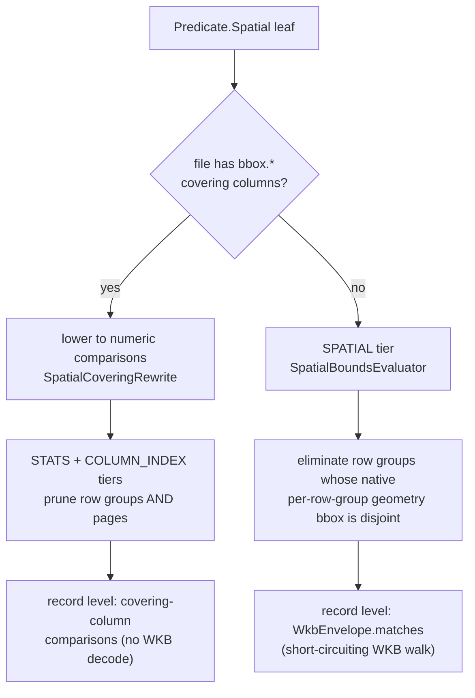

# Spatial filtering in parquetry

How a spatial predicate over a GeoParquet geometry column turns into pruned row
groups, skipped pages, and an exact per-row test - without a geometry engine in
the core. This is the spatial face of the read path; read
[The parquetry read path](read-path.md) first for the four-stage pipeline this
hangs on.

The guiding rule: **the core filters on the geometry's 2D bounding box only.**
Every relation below is an honest rectangle relation, evaluated exactly. True
geometry tests (a real intersects against the curve, not its envelope) are the
job of a geometry-engine integration, never the core.

---

## 1. The predicate family

The predicate ADT exposes a closed family of four bbox relations under the sealed
`Predicate.Spatial`. Each compares the geometry's 2D bounding box against a query
`Bbox`, edges inclusive, Z ignored.

| Relation | True when the geometry's bbox ... | Builder |
|----------|-----------------------------------|---------|
| `BboxIntersects` | overlaps the query box | `Pred.col("geometry").bboxIntersects(q)` |
| `BboxContains` | encloses the query box | `Pred.col("geometry").bboxContains(q)` |
| `BboxCoveredBy` | is enclosed by the query box | `Pred.col("geometry").bboxCoveredBy(q)` |
| `BboxEquals` | matches the query box on all four edges | `Pred.col("geometry").bboxEquals(q)` |

The query box is a `Bbox`: `Bbox.of2d(minX, minY, maxX, maxY)` (or `of3d(...)`,
though the relations compare X/Y only). The family is closed on purpose: the core
never exposes a predicate it cannot evaluate exactly. There are no
`DWithin` / `Within` / `Overlaps` stubs that would silently return wrong rows.

---

## 2. Using it

A spatial read is an ordinary `read()` with a spatial predicate. The geometry
column is decoded for the filter even when it is outside the projection.

```java
Bbox manhattan = Bbox.of2d(-74.05, 40.68, -73.90, 40.88);

try (ByteRangeSource source = ByteRangeSource.ofFile(path)) {
    ParquetDataset dataset = ParquetDataset.open(source);
    try (Stream<ParquetRecord> rows = dataset.read(
            Pred.col("geometry").bboxIntersects(manhattan),
            Projection.ALL,
            ReadOptions.DEFAULTS)) {
        rows.forEach(record -> { /* ... */ });
    }
}
```

A spatial predicate composes with the rest of the ADT: `And` / `Or` with
attribute predicates, and `Not` around a spatial relation, all behave as usual
(see [section 5](#5-null-geometries) for the one subtlety, null geometries).

---

## 3. How it filters

A spatial predicate is filtered at three levels, cheapest first - the same
"filter, then fetch, then decode" order as every other predicate. Which row-group
and page levels apply depends on what statistics the file provides
([section 4](#4-which-path-applies)).



**Record level - the exact test.** `WkbEnvelope.matches` walks the geometry's WKB
and decides the relation while it reads, stopping as soon as the answer is fixed:
`BboxIntersects` / `BboxContains` return true the moment the running envelope
satisfies the relation; `BboxCoveredBy` returns false on the first vertex outside
the query; `BboxEquals` needs the full envelope. The walk is shared with the
write-side statistics accumulator; one WKB parser serves both sides.

The walk accepts both WKB type-code encodings: ISO (Z/M/ZM via the
`+1000`/`+2000`/`+3000` offsets) and EWKB (Z/M via the `0x80000000`/`0x40000000`
high-bit flags, as JTS and PostGIS write them). An EWKB `0x20000000` SRID flag is
recognized and its 4-byte payload skipped. Per the parquet-format spec, the
`geospatial_types` recorded in the written statistics are always normalized to ISO
codes, whichever encoding the input used.

**Row-group and page pruning** comes from one of two mechanisms:

- **Covering-column lowering.** A GeoParquet 1.1 file stores each row's bounding
  box in four `bbox.*` sidecar columns. Since those columns are the geometry's
  exact 2D box, every relation is equivalent to a conjunction of numeric
  comparisons on them - for example `BboxIntersects(q)` is `xmin <= q.maxX AND
  xmax >= q.minX AND ymin <= q.maxY AND ymax >= q.minY`. `SpatialCoveringRewrite`
  rewrites the spatial leaf into that conjunction at read time, and the existing
  STATS and COLUMN_INDEX tiers prune row groups *and* pages from the sidecar
  columns' statistics. The geometry WKB is never decoded for the filter.
- **Native row-group bounds.** A GeoParquet 2.0 file stores a per-row-group
  geometry bounding box in the column chunk's statistics. The `SPATIAL` tier
  (`SpatialBoundsEvaluator`) eliminates a row group whose box is disjoint from the
  query (`BboxContains` instead keeps only groups whose box can enclose the
  query). This is row-group granularity only - native statistics are per chunk,
  not per page.

---

## 4. Which path applies

The two pruning mechanisms target different files, and a single read picks
whichever the file supports:

| The file has ... | Row-group pruning | Page pruning | Record-level test |
|------------------|-------------------|--------------|-------------------|
| `bbox.*` covering columns (GeoParquet 1.1) | yes (lowered comparisons) | yes | covering comparisons, no WKB decode |
| native per-row-group geometry stats (GeoParquet 2.0) | yes (SPATIAL tier) | no | `WkbEnvelope.matches` on WKB |
| neither | no | no | `WkbEnvelope.matches` on WKB |

Files written by parquetry use the native path: the writer emits per-row-group
geometry statistics but not `bbox.*` covering columns. Files written by tools that
emit GeoParquet 1.1 covering take the lowering path, which prunes pages too. With
no usable statistics, pruning declines to nothing and the result is still exact -
the record-level test decides every row.

Pruning is conservative everywhere: a row group or page is dropped only when its
statistics prove no row in it can match; pruning never changes which rows a
read returns, only how much work it does. Spatial clustering is what makes it pay
off; a file whose geometries are spread evenly across row groups prunes little.

---

## 5. Null geometries

A null (absent) geometry has no bounding box and therefore no spatial truth value.
Under OGC simple-feature semantics a relation against it is unknown, and a `WHERE`
keeps a row only when the predicate is true. A null-geometry row is excluded
from a spatial predicate **and from its negation** - the same way `col = v` and
`col <> v` both exclude a null `col`:

| geometry | `bboxIntersects(q)` | `NOT bboxIntersects(q)` |
|----------|---------------------|--------------------------|
| present, overlaps | kept | dropped |
| present, disjoint | dropped | kept |
| null | dropped | dropped |

A predicate and its negation are not complementary when nulls are present; the
null rows fall out of both. This only matters for an optional geometry column - a
required geometry never triggers it.

---

## 6. The bbox-only contract

The four relations compare bounding boxes, not geometries. For a polygon query
they answer "could these interact?", not "do these shapes actually intersect?".
That coarse answer is exactly what a spatial index gives, and it is enough to
prune the read down to a small candidate set.

True-geometry filtering - a real intersection against the curve, decimation,
reprojection - belongs to a geometry-engine integration, not the core. The
materializer that decodes WKB into a geometry object is output-only; it never runs
in the filter path. There are two ways to apply the exact test:

1. **Consumer-side re-check.** Push the query's envelope as a bbox relation; the
   core prunes and returns a candidate stream. Re-apply the exact geometry filter
   on the candidates in the consumer's own geometry model.
2. **In-core gate.** Inject a `GeometryFilter<T>` (`filter/GeometryFilter.java`)
   through `Predicate.geometryFilter(...)`. The filter provides a sound bbox
   lowering for coarse pruning plus an exact `matches` test; the reader prunes with
   the lowering, then runs the exact test per surviving row, dropping non-matches
   before their other columns materialize. `parquetry-geo-jts` ships
   `JtsGeometryFilter` over the JTS topology predicates. The gate decodes each
   surviving geometry once for the test; output materialization decodes the WKB
   again (reusing the gate's geometry as the output value is a possible future
   optimization).

---

## 7. Where to look

| Concern | Start in |
|---------|----------|
| Predicate family + builders | `filter/Predicate.java` (`Predicate.Spatial`), `filter/Pred.java` |
| Query box + 2D relations | `filter/Bbox.java` |
| Shared WKB walk + exact match | `filter/spatial/WkbEnvelope.java` |
| Record-level evaluation | `filter/RecordLevelEvaluator.java` |
| Covering-column lowering | `filter/spatial/SpatialCoveringRewrite.java` |
| Native row-group pruning | `filter/SpatialBoundsEvaluator.java`, `filter/Tier.java`, `filter/spatial/SpatialBoundsSource.java` |
| Exact geometry gate (SPI) | `filter/GeometryFilter.java`, `Predicate.geometryFilter(...)` |
| JTS-backed exact filter | `integrations/parquetry-geo-jts/.../JtsGeometryFilter.java` |
| Benchmarks | `internal/parquetry-benchmarks/.../SpatialPruningBenchmark.java`, `SpatialGateBenchmark.java`, `JtsSpatialFilterBenchmark.java` |

---

*Scope: bbox-based spatial filtering over a GeoParquet geometry column. True
geometry materialization (WKB to a JTS geometry) is in the `parquetry-geo-jts`
integration; the general read path is in [read-path.md](read-path.md).*
